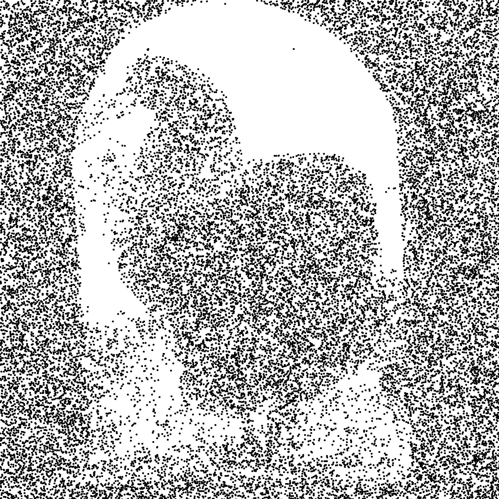
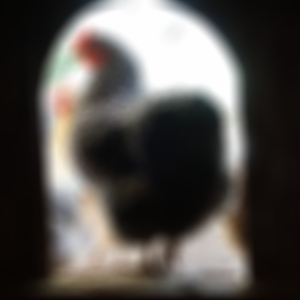
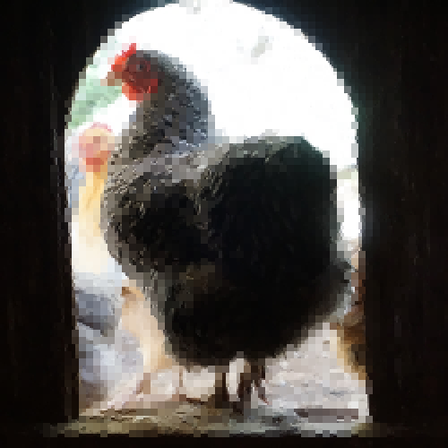
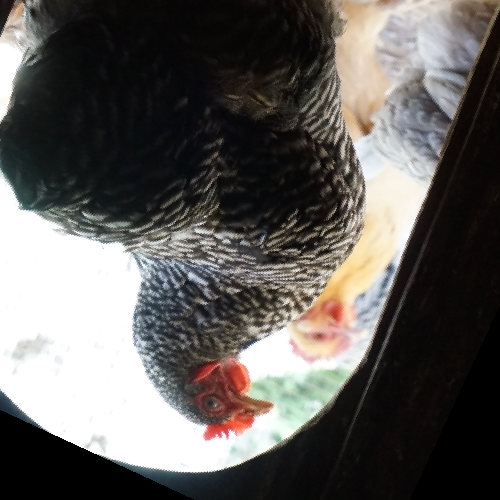
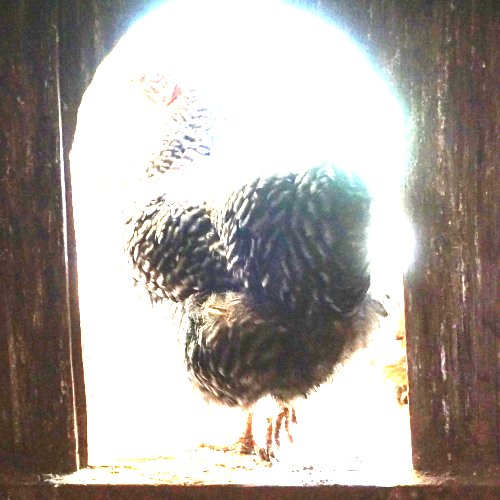

# Image Filterer

A collection of image filters. 

## Filters

* Color Difference Filter - recursively pixelate similar areas based upon similarity of color

* Luminosity Difference Filter - same as color difference filter, but using luminosity

* Pixelating Filter - simply pixelates the image

* Polygon Filter - randomly placed polygons (only pentagons currently)

* Triangle Filter - evenly spaced regular triangles

* Stipling Filter - a bunch of dots (evenly sized) randomly placed based on luminosity

* Blur Filter - blurs by getting average color in radius around each pixel

* Recursive Square Filter - like color difference filter, but choice to recurse is taken randomly

* Pixel Map Filter - basically the same as the blur filter AFAIK

* Affine Transform Filter - change angle (rotation), sheer, and scale

* Brightness Contrast Filter - change brightness and contrast

## Examples

## Additional work / notes

* All processing is done on the CPU, and is single threaded which makes it pretty slow.

* Can only use one filter at once. Using multiple filters in succession would be nice.